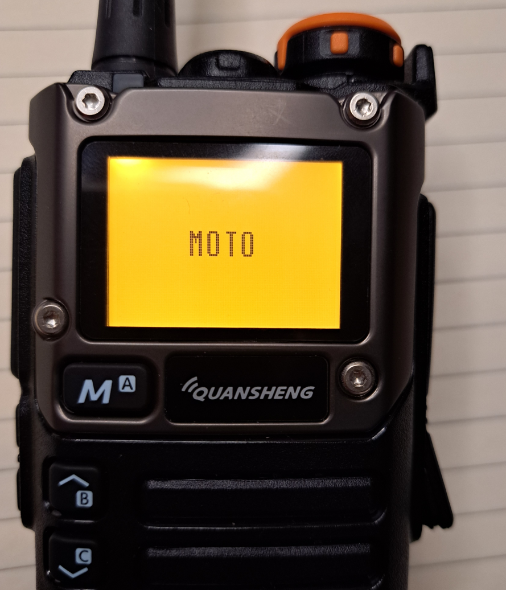
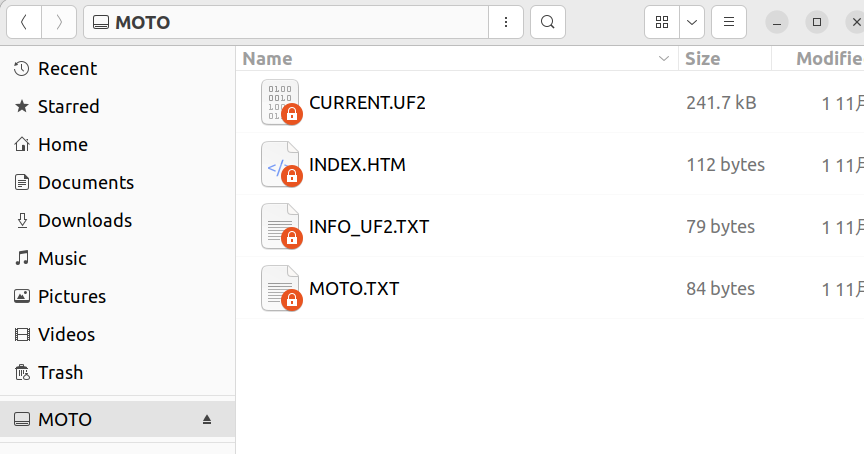

Similar to the stock bootloader, holding down the PTT button while powering on will enter Moto's DFU mode. At this point, the screen and keypad backlight illuminate, and the Moto logo appears on the screen.



Connect the radio to your computer via USB, and you will see a MOTO drive.



Within the MOTO disk, one file (among others) is of particular interest:

-    CURRENT.UF2 - This file contains the firmware

You can copy it to a safe place as a backup.

To perform flashing, simply copy the firmware (in UF2 format) to the MOTO disk. Ideally, firmware developers should provide files in UF2 format. If not, converting .bin format firmware to UF2 is straightforward, for example:

```shell
python utils/uf2conv.py -c -b 0x08002800 -o firmware.uf2 firmware.bin
```

The `uf2conv.py` Python script from the UF2 project (a copy is also stored in this repository) was used to convert `firmware.bin` to `firmware.uf2`. `0x08002800` is the firmware's address within the internal flash memory, which is fixed.

During the flashing process, the backlight will flash rapidly (so you know it's really FLASHING). After flashing completes, the backlight flashing stops. If the newly flashed firmware can be booted, Moto will immediately boot it. (If the firmware does not boot, it indicates that the firmware is not valid.)

Generally, updating the firmware takes just a few seconds.

After powering on, if the device directly enters Moto's DFU mode (PTT not pressed), it indicates that no valid firmware is present.
